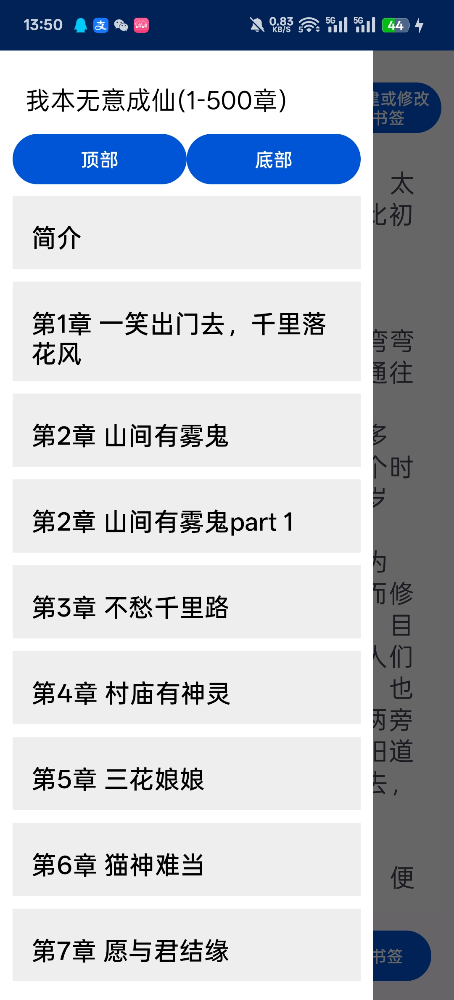

# 这是使用Kotlin开发的安卓电子书阅读器
## 包含功能：
- 导入txt，pdf书本
- 记录当前读取位置功能
- 阅读txt时有导航，支持快速跳转，支持章节书签
- 可以设置阅读时的字体，字间距，行间距大小
- 可以设置阅读时提醒的时间
- 可以统计你的阅读时间，阅读页码
- 个性化数据统计，显示阅读总时间，阅读页码等数据
- 时光旅行，显示书本排行榜
- 可以设置夜晚模式
## 展示图：

## 目前已知存在问题：
- 识别章节依靠“\n第X章XX\n”的标识，可能会出现章节不正确识别错误
- 章节内容至少需要每10240个字节有一个换行符，否则会出现严重错误
- pdf阅读器功能不完善，仅可阅读
- 提醒功能不能精确报时，误差在1秒内
